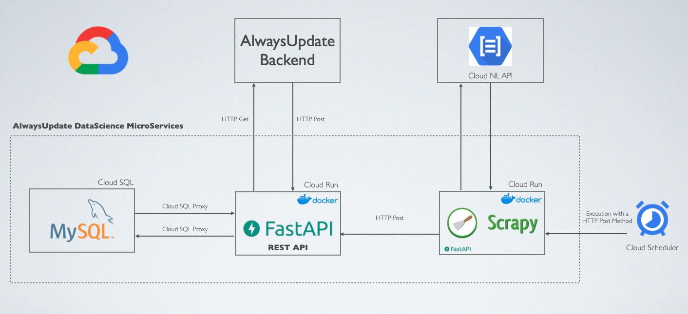

# Our Service

</img>

We use web scraping to find relevant news for you.

Our technologies are similar to what Google uses for its search engine.

We take several starting URLs (journal's webpages), and our system finds the links to relevant news, this creates a link network which you can imagine it like a spiderweb. Once the system finds a news article, it extracts the information and saves it in our databases.

We search for new articles several times in the day so you can have the most updated news at your hand.

## Sentiment Analysis

While the article is being saved, we execute a Artificial Intelligent algorithm on it to calculate its sentiment so you can select the news according to your state of humor.

You can see the sentiment classification in each news card:
* [PUT Carita feliz]: Noticia positiva
* [PUT Carita neutra]: Noticia neutra
* [PUT Carita triste]: Noticia triste

[Poner una tarjeta de ejemplo]

# Our Technology

Our approach to developing our application is the microservices, so the DataScience and Artificial Intelligence code is separated from the Backend, this allows us to fix errors in the extracting code with the site 100% life.

Therefore, the communication is made using an independent REST API for DataScience, which interacts with the Backend API.

It's very important to mention that the Scrapy web scraper is being executed in an independent internal service, this is perfect to work or fix errors on it without stopping the main DataScience API

Also, we use several open source technologies.

</img>

